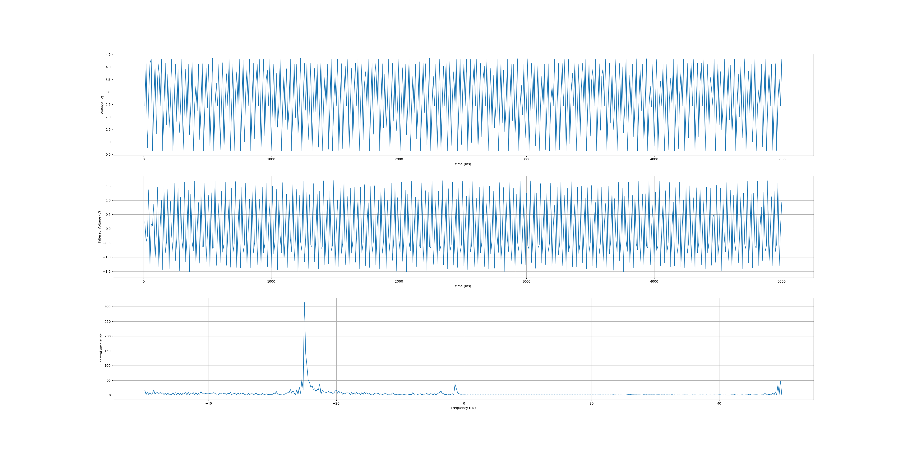

# EEG_DIY
## Building EEG from Arduino and playing with the data

## Long term goals: 

### 1- control motor with EEG

### 2- Use Tensorflow to classify EEG data
	
	a) can a model tell whether or not I have had my coffee?
	
	b) can a model predict my emotion?

## Steps

### 1- Read analog voltage (potentiometer) from arduino into python

### 2- Grab discrete chunk of voltage data and write to file
The plan is to use these chunks as training data
The filtering right now is just a high-pass filter - This will likely change as instrumentation is set up

